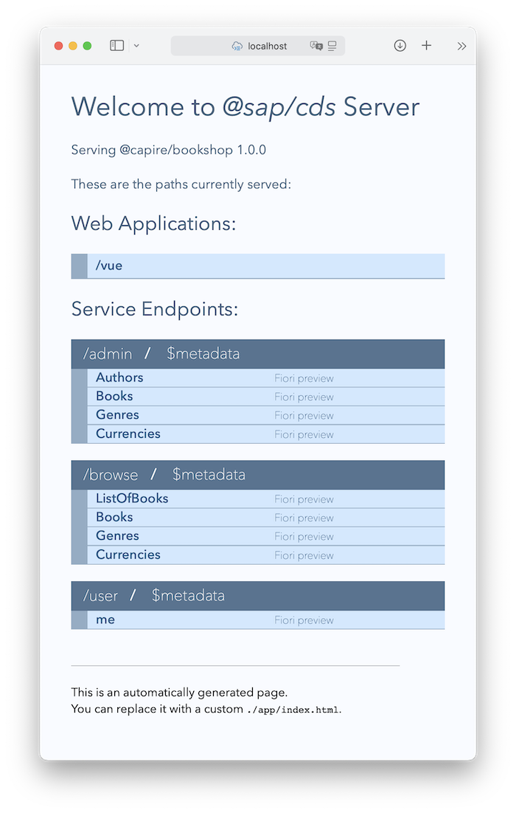

# Welcome to cap/samples

Find here a collection of samples for the [SAP Cloud Application Programming Model](https://cap.cloud.sap) organized in a simplistic [monorepo setup](samples.md#all-in-one-monorepo).

[See Overview of contained samples](samples.md):


## Get Started

### Jumpstart

Assumed you have finished your [initial setup of CAP Node.js](https://cap.cloud.sap/docs/get-started/#setup), simply copy and dump these lines to your terminal for a jumpstart:

```sh
git clone -q https://github.com/sap-samples/cloud-cap-samples cap/samples
cd cap/samples
npm install
npm test
npm start
```

This download the sample content, does a minimum setup, and after running some tests and launching the bookshop server, it should open a browser window on http://localhost:4004 which looks like that:



Click on the *[/vue](http:/localhost:4004/vue)* link at the top to display the bookshop app. When asked to log in, type `alice` as user and leave the password field blank.

### Grow as you go...

## Get Help

- Learn about CAP in the *capire* docs at [https://cap.cloud.sap](https://cap.cloud.sap). 
- Especially the [Getting Started in a Nutshell](https://cap.cloud.sap/docs/get-started/in-a-nutshell) guide
- Ask questions and get support in our [community](https://answers.sap.com/tags/9f13aee1-834c-4105-8e43-ee442775e5ce) 


## License

Copyright (c) 2022 SAP SE or an SAP affiliate company. All rights reserved. This file is licensed under the Apache Software License, version 2.0 except as noted otherwise in the [LICENSE](LICENSE) file.
