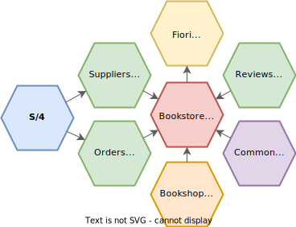

# Welcome to cap/samples

Find here a collection of samples for the [SAP Cloud Application Programming Model](https://cap.cloud.sap) organized in a simplistic [monorepo setup](samples.md#all-in-one-monorepo).

[See **Overview** of contained samples](samples.md):




### Preliminaries

Ensure you have the latest LTS version of Node.js, [`@sap/cds-dk`](https://www.npmjs.com/package/@sap/cds-dk) installed globally, `git` and your IDE ready (see [Initial Setup](https://cap.cloud.sap/docs/get-started/#setup))

### Download

[Git](https://git-scm.com/downloads) clone this repo as shown below, or [download as zip file](../../archive/refs/heads/main.zip).

```sh
git clone https://github.com/sap-samples/cloud-cap-samples cap/samples
cd cap/samples
```

### Setup

In the samples folder run:

```sh
npm install
```

### Run

With that you're ready to run the samples, for example:

```sh
npm run bookshop
```

> After that open this link in your browser: [http://localhost:4004](http://localhost:4004)
> <br> When asked to log in, type `alice` as user and leave the password field blank. 
> <br> Learn more about [mock users](https://cap.cloud.sap/docs/node.js/authentication#mocked).


### Testing

Run the provided tests like so:

```sh
npm test
```
> You can alternative run the tests with [_jest_](http://jestjs.io) or [_mocha_](http://mochajs.org).

## Get Support

Check out the documentation at [https://cap.cloud.sap](https://cap.cloud.sap). <br>
In case you've a question, find a bug, or otherwise need support, use our [community](https://answers.sap.com/tags/9f13aee1-834c-4105-8e43-ee442775e5ce) to get more visibility.


## License

Copyright (c) 2022 SAP SE or an SAP affiliate company. All rights reserved. This file is licensed under the Apache Software License, version 2.0 except as noted otherwise in the [LICENSE](LICENSE) file.
