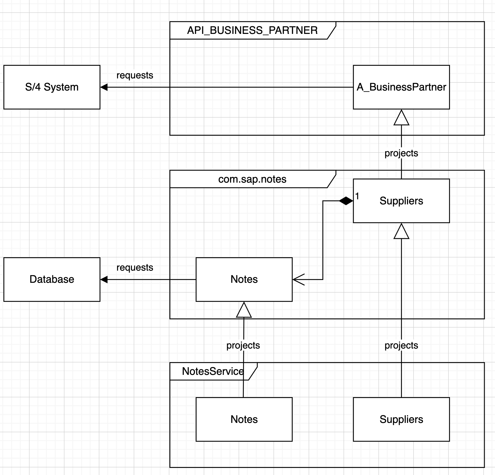

# S4 Extension with CAP

## Scenario

This sample applications shows how to extend an existing oData service on BTP using CAP.

In our scenario, we want to extend the entity `A_BusinessPartner` of an external service ([BusinessPartner API](https://api.sap.com/api/API_BUSINESS_PARTNER/resource)) with a `note` field so that our end-users of the applictions can maintain notes for each business partner
## Diagramm

## Usage

### Business Partner Local Mock

Start a CAP process for the local mock server for Business Partner and a second one for the CustomerService:

1. Run: `cds mock API_BUSINESS_PARTNER -p 5001`
2. Wait until startup is completed
3. Run in a 2nd terminal: `cds serve all --with-mocks --in-memory`
4. Now, you can issues the requests listed in `requests.http`

### Business Partner from Sandbox Server

1. Goto https://api.sap.com/api/API_BUSINESS_PARTNER/resource
2. Get service key
3. Export env var `S4_APIKEY` with the service key (`export S4_APIKEY="<your-service-key>"`)
4. Run: `CDS_ENV=sandbox cds watch`
5. Now, you can issues the requests listed in `requests.http`
